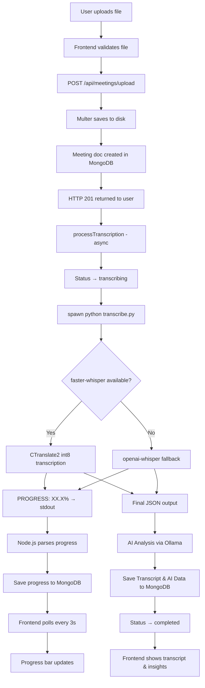

# 🧠 AI Meeting Intelligence System — Project Implementation Status

**Document Version:** 1.0  
**Date:** July 16, 2026  
**Author:** Auto-generated from codebase inspection  
**Repository Root:** `d:\final year project\`

---

## 📋 Project Overview

### What This Project Currently Does

The AI Meeting Intelligence System is a web application that allows authenticated users to upload audio/video recordings of meetings and automatically generates text transcripts using Whisper-based speech-to-text AI. Users can view, search within, copy, and download transcripts through a polished React frontend.

### Project Goals (from PRD)

The long-term vision extends far beyond current implementation — the PRD describes a system capable of:

- Speech-to-text transcription *(implemented)*
- AI-powered meeting summarization *(implemented via Ollama)*
- Speaker diarization *(planned)*
- Sentiment analysis & emotion recognition *(planned)*
- Intent recognition *(planned)*
- Action item extraction with priority scoring *(implemented via Ollama)*
- Decision & question detection *(planned)*
- Retrieval-Augmented Generation (RAG) search *(planned)*
- Semantic search across meeting history *(planned)*
- Analytics dashboard *(planned)*
- Calendar integration *(planned)*

### Current End-to-End Workflow

```
User registers/logs in
        ↓
Navigates to "Upload Meeting"
        ↓
Selects audio/video file + enters title
        ↓
Frontend validates file type & size
        ↓
File uploaded to server via multipart POST
        ↓
Server stores file on disk (server/uploads/)
        ↓
Meeting document created in MongoDB (status: "uploaded")
        ↓
Response sent immediately to user (non-blocking)
        ↓
Background: Python transcribe.py invoked via child_process.spawn
        ↓
faster-whisper (CTranslate2, int8) processes audio
        ↓
Progress streamed via stdout → saved to MongoDB
        ↓
Frontend polls every 3s → shows progress bar
        ↓
AI Meeting Intelligence Engine runs (Ollama)
        ↓
Transcript & AI Analysis saved to MongoDB
        ↓
User views/searches/copies/downloads transcript and AI insights
```

---

## 🛠️ Technology Stack

| Layer | Technology | Version |
|-------|-----------|---------|
| **Frontend** | React | 19.2.7 |
| **Build Tool** | Vite | 8.1.1 |
| **Routing** | react-router-dom | 7.18.1 |
| **HTTP Client** | Axios | 1.18.1 |
| **Linter** | oxlint | 1.71.0 |
| **Backend** | Express.js | 5.2.1 |
| **Runtime** | Node.js | (system) |
| **Database** | MongoDB + Mongoose | 9.7.4 |
| **Authentication** | jsonwebtoken | 9.0.3 |
| **Password Hashing** | bcryptjs | 3.0.3 |
| **File Upload** | Multer | 2.2.0 |
| **Validation** | express-validator | 7.3.2 |
| **Speech-to-Text (primary)** | faster-whisper (Python) | 1.2.1 |
| **Speech-to-Text (fallback)** | openai-whisper (Python) | installed |
| **AI Inference Engine (STT)** | CTranslate2 | 4.8.1 |
| **AI LLM Engine** | Ollama (qwen2.5:7b) | (system) |
| **Audio Processing** | FFmpeg (via WinGet, Gyan build) | 8.1.2 |
| **Python** | CPython | 3.11 |
| **Styling** | Vanilla CSS (Material Design 3 tokens) | — |
| **ID Generation** | uuid | 14.0.1 |
| **Environment** | dotenv | 17.4.2 |
| **CORS** | cors | 2.8.6 |

---

## 📁 Current Folder Structure

```
d:\final year project\
├── client\                          # React Frontend (Vite)
│   ├── index.html                   # HTML entry point with SEO meta tags
│   ├── package.json                 # Frontend dependencies
│   ├── vite.config.js               # Vite config with API proxy
│   ├── public\                      # Static assets
│   └── src\
│       ├── main.jsx                 # React DOM entry
│       ├── App.jsx                  # Root component with routing
│       ├── components\
│       │   ├── LoadingSpinner.jsx   # Reusable spinner
│       │   ├── Navbar.jsx           # Top navigation bar
│       │   ├── ProtectedRoute.jsx   # Auth guard wrapper
│       │   └── Sidebar.jsx          # Side navigation
│       ├── context\
│       │   └── AuthContext.jsx      # Auth state management (useReducer)
│       ├── pages\
│       │   ├── Dashboard.jsx        # Welcome page with stats placeholders
│       │   ├── Login.jsx            # Login form
│       │   ├── Register.jsx         # Registration form
│       │   ├── Meetings.jsx         # Meeting list page
│       │   ├── MeetingUpload.jsx    # File upload form with drag & drop
│       │   └── MeetingTranscript.jsx# Transcript viewer with progress bar
│       ├── services\
│       │   └── api.js               # Axios instance + API methods
│       ├── styles\
│       │   └── index.css            # Full design system (~26KB)
│       └── assets\
│           ├── hero.png
│           ├── react.svg
│           └── vite.svg
│
├── server\                          # Express Backend
│   ├── server.js                    # Express app entry + health check
│   ├── package.json                 # Backend dependencies
│   ├── .env                         # Environment variables
│   ├── config\
│   │   └── db.js                    # MongoDB connection
│   ├── controllers\
│   │   ├── authController.js        # Register, Login, Profile handlers
│   │   └── meetingController.js     # Upload, CRUD, transcription trigger
│   ├── middleware\
│   │   ├── auth.js                  # JWT verification middleware
│   │   └── upload.js                # Multer config + file validation
│   ├── models\
│   │   ├── User.js                  # User schema (bcrypt hashing)
│   │   └── Meeting.js               # Meeting schema with progress tracking
│   ├── routes\
│   │   ├── auth.js                  # Auth routes with express-validator
│   │   └── meetings.js              # Meeting CRUD routes
│   ├── services\
│   │   └── transcriptionService.js  # Python process manager (spawn)
│   ├── scripts\
│   │   └── transcribe.py            # Python Whisper transcription script
│   └── uploads\                     # Uploaded files stored here
│       └── .gitkeep
│
├── goal\                            # Planning documents
│   ├── week1.md
│   └── week2.md
├── prd.md                           # Product Requirements Document
└── timelineplan.md                  # 7-week development timeline
```

---

## 🏗️ System Architecture

```
┌─────────────────────────────────────────────────────────┐
│                       USER (Browser)                     │
└──────────────────────────┬──────────────────────────────┘
                           │
                           ▼
┌─────────────────────────────────────────────────────────┐
│              REACT FRONTEND  (Vite, port 5173)          │
│  ┌──────────┐ ┌───────────┐ ┌─────────┐ ┌───────────┐  │
│  │  Login   │ │ Dashboard │ │Meetings │ │ Transcript│  │
│  │ Register │ │           │ │ Upload  │ │  Viewer   │  │
│  └──────────┘ └───────────┘ └─────────┘ └───────────┘  │
│       AuthContext (useReducer)  │  Axios + JWT           │
└──────────────────────────┬──────────────────────────────┘
                           │  HTTP REST (JSON)
                           ▼
┌─────────────────────────────────────────────────────────┐
│           EXPRESS BACKEND  (Node.js, port 5000)         │
│  ┌────────┐  ┌───────────┐  ┌────────────────────────┐  │
│  │  Auth  │  │ Meetings  │  │  Health Check          │  │
│  │ Routes │  │  Routes   │  │  /api/health           │  │
│  └───┬────┘  └─────┬─────┘  └────────────────────────┘  │
│      │             │                                     │
│  ┌───▼────┐  ┌─────▼──────────┐  ┌────────────────┐     │
│  │  Auth  │  │   Meeting      │  │   Upload       │     │
│  │  MW    │  │   Controller   │  │   Middleware    │     │
│  │ (JWT)  │  │                │  │   (Multer)     │     │
│  └────────┘  └───────┬────────┘  └────────────────┘     │
└──────────────────────┼──────────────────────────────────┘
                       │  child_process.spawn
                       ▼
┌─────────────────────────────────────────────────────────┐
│            PYTHON PROCESSING LAYER                       │
│  ┌────────────────────────────────────────────────────┐  │
│  │  transcribe.py                                     │  │
│  │  ├─ FFmpeg resolution (.env → PATH → shutil)       │  │
│  │  ├─ faster-whisper (CTranslate2, int8, CPU)        │  │
│  │  ├─ openai-whisper (fallback)                      │  │
│  │  ├─ VAD filtering (skip silence)                   │  │
│  │  └─ PROGRESS: XX.X% (stdout streaming)             │  │
│  └────────────────────────────────────────────────────┘  │
└──────────────────────┬──────────────────────────────────┘
                       │
            ┌──────────┼──────────┐
            ▼          ▼          ▼
     ┌──────────┐ ┌─────────┐ ┌───────────┐
     │ MongoDB  │ │  Disk   │ │  FFmpeg   │
     │ (Data)   │ │ Storage │ │ (WinGet)  │
     └──────────┘ └─────────┘ └───────────┘
```

---

## 📊 Feature Status

| Feature | Description | Status | Completion | Key Files |
|---------|-------------|--------|------------|-----------|
| User Registration | Name, email, password with validation | 🟢 Completed | 100% | `authController.js`, `Register.jsx`, `User.js` |
| User Login | Email/password with JWT token | 🟢 Completed | 100% | `authController.js`, `Login.jsx` |
| User Profile | Fetch authenticated user profile | 🟢 Completed | 100% | `authController.js` (getProfile) |
| JWT Authentication | Bearer token auth middleware | 🟢 Completed | 100% | `middleware/auth.js`, `AuthContext.jsx` |
| Protected Routes | Frontend route guards | 🟢 Completed | 100% | `ProtectedRoute.jsx`, `App.jsx` |
| Dashboard Layout | Navbar + Sidebar + content area | 🟢 Completed | 100% | `Navbar.jsx`, `Sidebar.jsx`, `App.jsx` |
| Dashboard Stats | Meeting count, tasks, sentiment | 🟡 Partial | 30% | `Dashboard.jsx` (hardcoded placeholders) |
| File Upload (drag & drop) | Drag-drop + browse with validation | 🟢 Completed | 100% | `MeetingUpload.jsx`, `upload.js` |
| Upload Progress Bar | Shows upload % during file transfer | 🟢 Completed | 100% | `MeetingUpload.jsx`, `api.js` |
| Meeting List Page | List all meetings with status badges | 🟢 Completed | 100% | `Meetings.jsx` |
| Meeting Deletion | Delete meeting + file cleanup | 🟢 Completed | 100% | `meetingController.js` (deleteMeeting) |
| Whisper Transcription | Speech-to-text via faster-whisper | 🟢 Completed | 100% | `transcribe.py`, `transcriptionService.js` |
| Transcription Progress | Real-time % progress during processing | 🟢 Completed | 100% | `transcribe.py`, `transcriptionService.js`, `MeetingTranscript.jsx` |
| Transcript Viewer | Display transcript with search/copy/download | 🟢 Completed | 100% | `MeetingTranscript.jsx` |
| Transcript Search | In-page text search with highlight | 🟢 Completed | 100% | `MeetingTranscript.jsx` |
| Transcript Copy | Copy to clipboard | 🟢 Completed | 100% | `MeetingTranscript.jsx` |
| Transcript Download | Download as .txt | 🟢 Completed | 100% | `MeetingTranscript.jsx` |
| FFmpeg Detection | Auto-detect from .env, PATH, WinGet | 🟢 Completed | 100% | `transcribe.py` |
| Health Check | System status + Whisper availability | 🟢 Completed | 100% | `server.js` |
| AI Summarization | LLM-generated meeting summaries | 🟢 Completed | 100% | `ollama.service.js`, `meeting.processor.js` |
| Speaker Diarization | Identify individual speakers | ⚪ Planned | 0% | *Not implemented* |
| Sentiment Analysis | Positive/Negative/Neutral detection | ⚪ Planned | 0% | *Not implemented* |
| Emotion Recognition | Happy, Frustrated, Concerned, etc. | ⚪ Planned | 0% | *Not implemented* |
| Intent Recognition | Question, Decision, Task, Suggestion | ⚪ Planned | 0% | *Not implemented* |
| Action Item Extraction | Tasks with owner, deadline, priority | 🟢 Completed | 100% | `ollama.service.js`, `meeting.processor.js` |
| Decision Detection | Extract decisions from conversations | ⚪ Planned | 0% | *Not implemented* |
| RAG Search | Vector embeddings + semantic Q&A | 🟢 Completed | 100% | `chatOrchestratorService.js` |
| Semantic Search | Natural language meeting search | 🟢 Completed | 100% | `retrievalService.js` |
| Analytics Dashboard | Charts, trends, statistics | ⚪ Planned | 0% | *ComingSoon placeholder in App.jsx* |
| Calendar Integration | Export tasks to Google/Outlook/ICS | ⚪ Planned | 0% | *Not implemented* |
| Notifications | Deadline & task reminders | ⚪ Planned | 0% | *Not implemented* |
| Navbar Search | Global meeting search from navbar | ⚪ Planned | 0% | `Navbar.jsx` (UI exists, no backend) |
| Settings Page | User preferences | ⚪ Planned | 0% | *ComingSoon placeholder* |
| Tasks Page | Action item management | ⚪ Planned | 0% | *ComingSoon placeholder* |

---

## 🔐 Authentication

### Implementation Details

| Component | Status | Details |
|-----------|--------|---------|
| **Registration** | 🟢 Completed | Name (2–50 chars), email (unique, normalized), password (min 6 chars, hashed with bcrypt salt 12) |
| **Login** | 🟢 Completed | Email + password → JWT token (7-day expiry) |
| **JWT Middleware** | 🟢 Completed | Bearer token extraction, verification, user lookup, expired/invalid handling |
| **Protected Routes** | 🟢 Completed | `ProtectedRoute.jsx` wraps all authenticated pages; redirects to `/login` |
| **Token Persistence** | 🟢 Completed | Stored in `localStorage` (token + user JSON) |
| **Token Verification** | 🟢 Completed | `AuthContext` verifies token on mount via `GET /api/auth/profile` |
| **Auto Logout** | 🟢 Completed | Axios interceptor clears token + redirects on 401 |
| **Validation** | 🟢 Completed | Server-side via `express-validator`; client-side field validation in forms |
| **Password Reset** | ⚪ Planned | Mentioned in PRD, not implemented |
| **Role-Based Access** | 🟡 Partial | `role` field exists in User model (`user`/`admin`), but no role checks exist |

### User Model (`server/models/User.js`)

| Field | Type | Constraints |
|-------|------|-------------|
| `name` | String | Required, 2–50 chars, trimmed |
| `email` | String | Required, unique, lowercase, regex validated |
| `password` | String | Required, min 6 chars, `select: false`, hashed pre-save |
| `role` | String | Enum: `user`, `admin`. Default: `user` |
| `avatar` | String | Default: empty string |
| `timestamps` | Auto | `createdAt`, `updatedAt` |

---

## 📤 Meeting Upload Flow

### Actual Implementation (step by step)

```
1. User navigates to /meetings/upload
        ↓
2. MeetingUpload.jsx renders drag-drop zone
        ↓
3. User selects/drops file
   - Frontend validates: extension (.mp3,.wav,.m4a,.mp4,.mov,.webm)
   - Frontend validates: size ≤ 100MB
   - Auto-fills title from filename
        ↓
4. User clicks "Upload & Transcribe"
        ↓
5. Axios POST /api/meetings/upload (multipart/form-data)
   - onUploadProgress callback → progress bar
        ↓
6. Server middleware chain:
   - auth.js → verifies JWT
   - upload.js (Multer) → validates MIME type + extension
   - Saves file to server/uploads/ with UUID filename
        ↓
7. meetingController.uploadMeeting():
   - Creates Meeting document in MongoDB (status: "uploaded")
   - Returns 201 response immediately
   - Calls processTranscription() asynchronously (non-blocking)
        ↓
8. processTranscription():
   - Updates status → "transcribing"
   - Calls transcribeFile() with onProgress callback
        ↓
9. transcriptionService.js:
   - Spawns: python scripts/transcribe.py <filePath> --model base --language en
   - Reads stdout stream for "PROGRESS: XX.X" lines
   - onProgress callback saves progress to MongoDB (throttled: every 2s)
        ↓
10. transcribe.py:
    - Reads FFMPEG_PATH from .env
    - Prepends ffmpeg dir to os.environ["PATH"]
    - Loads faster-whisper model (int8, all CPU threads)
    - Transcribes with VAD filter + greedy decoding
    - Emits "PROGRESS: XX.X" per segment
    - Outputs final JSON to stdout
        ↓
11. meetingController (Decoupled Workflow):
    - Wait for Whisper to succeed
    - Start AI Meeting Intelligence (ollama.service.js)
    - If AI succeeds, save transcript + aiAnalysis to MongoDB
    - If AI fails, save transcript + empty object to MongoDB
    - Update status → "completed"
        ↓
12. Frontend (MeetingTranscript.jsx):
    - Polls GET /api/meetings/:id every 3 seconds
    - Shows progress bar when transcriptionProgress > 0
    - Stops polling when status is "completed" or "failed"
    - Renders transcript & AI insights with search/copy/download tools
```

> [!IMPORTANT]
> There is **no audio format conversion step** (e.g., MP4→MP3 via FFmpeg). Files are passed directly to Whisper in their original format. FFmpeg is used internally by Whisper/faster-whisper for audio decoding — not explicitly by the application code.

---

## 🎵 Audio Processing Pipeline

### Current Implementation

| Step | Implementation | Status |
|------|---------------|--------|
| **Supported input formats** | MP3, WAV, M4A, AAC, MP4, MOV, WebM, AVI | 🟢 Completed |
| **MIME validation** | `upload.js` validates against `ALLOWED_MIME_TYPES` map | 🟢 Completed |
| **Extension validation** | Both frontend and backend validate extensions | 🟢 Completed |
| **Size limit** | 100MB (configurable via `MAX_FILE_SIZE` env var) | 🟢 Completed |
| **Storage** | Disk storage at `server/uploads/` with UUID filenames | 🟢 Completed |
| **Audio normalization** | ⚪ Planned | Not implemented |
| **Noise reduction** | ⚪ Planned | Not implemented |
| **Format conversion** | ⚪ Planned | Not implemented (Whisper handles decoding internally) |
| **Temporary file cleanup** | 🟡 Partial | Files deleted on meeting deletion; no post-processing cleanup |

### Libraries Used

| Library | Purpose | Location |
|---------|---------|----------|
| Multer 2.2.0 | Multipart file upload handling | `middleware/upload.js` |
| uuid 14.0.1 | Unique filename generation | `middleware/upload.js` |
| FFmpeg 8.1.2 | Audio decoding (used internally by Whisper) | System binary via WinGet |
| faster-whisper 1.2.1 | Audio file loading + transcription | `scripts/transcribe.py` |

---

## 🎤 Whisper Integration

### Architecture

| Property | Value |
|----------|-------|
| **Primary Engine** | `faster-whisper` 1.2.1 (CTranslate2 backend) |
| **Fallback Engine** | `openai-whisper` (PyTorch) |
| **Compute Type** | `int8` (quantized for CPU speed) |
| **Device** | CPU (no CUDA available) |
| **CPU Threads** | `os.cpu_count()` (all cores) |
| **Beam Size** | 1 (greedy decoding for speed) |
| **VAD Filter** | Enabled (min silence: 500ms) |
| **Default Model** | `base` (configurable via `WHISPER_MODEL` env var) |
| **Default Language** | `en` (configurable via `WHISPER_LANGUAGE` env var) |
| **Invocation** | `child_process.spawn` from Node.js |
| **Progress Reporting** | `PROGRESS: XX.X` lines on stdout |
| **Output Format** | JSON on stdout (last line) |
| **Timeout** | 5 minutes |
| **Retry Logic** | 3 attempts with exponential-ish backoff (2s, 4s, 6s) |

### Script: `transcribe.py`

| Function | Purpose |
|----------|---------|
| `get_env_ffmpeg_path()` | Reads `FFMPEG_PATH` from `.env` file |
| `find_ffmpeg()` | Resolves FFmpeg: .env → `shutil.which()` |
| `get_diagnostics(file_path)` | Returns debug info: python path, cwd, ffmpeg path, file existence |
| `return_error(message, details)` | Outputs error JSON and exits |
| `main()` | CLI entry: arg parsing → validation → model loading → transcription → JSON output |

### JSON Output Schema (success)

```json
{
  "success": true,
  "text": "Full transcript text...",
  "language": "en",
  "duration": 125.50,
  "wordCount": 842,
  "engine": "faster-whisper",
  "processingTime": 34.21,
  "diagnostics": { ... }
}
```

---

## 🗄️ Database Design

### Collection: `users`

| Field | Type | Constraints | Purpose |
|-------|------|-------------|---------|
| `_id` | ObjectId | Auto-generated | Primary key |
| `name` | String | Required, 2–50 chars | Display name |
| `email` | String | Required, unique, lowercase | Login identifier |
| `password` | String | Required, min 6, select: false | Hashed (bcrypt, salt 12) |
| `role` | String | Enum: user/admin, default: user | Authorization (unused) |
| `avatar` | String | Default: '' | Profile image URL (unused) |
| `createdAt` | Date | Auto (timestamps) | Account creation |
| `updatedAt` | Date | Auto (timestamps) | Last modification |

### Collection: `meetings`

| Field | Type | Constraints | Purpose |
|-------|------|-------------|---------|
| `_id` | ObjectId | Auto-generated | Primary key |
| `title` | String | Required, 2–200 chars | Meeting name |
| `description` | String | Max 1000 chars, default: '' | Optional notes |
| `originalFileName` | String | Required | User's original filename |
| `storedFileName` | String | Required, unique | UUID-based filename on disk |
| `filePath` | String | Required | Absolute path to stored file |
| `fileType` | String | Enum: audio/video | Determined from MIME type |
| `mimeType` | String | Required | Original MIME type |
| `fileSize` | Number | Required | File size in bytes |
| `duration` | Number | Default: null | Audio duration in seconds |
| `status` | String | Enum: uploading/uploaded/transcribing/completed/failed | Overall state |
| `uploadedBy` | ObjectId | Required, ref: User | Owner relationship |
| `transcript` | String | Default: '' | Full transcript text |
| `transcriptionStatus` | String | Enum: pending/processing/completed/failed | Transcription state |
| `transcriptionProgress` | Number | 0–100, default: 0 | Real-time progress percentage |
| `transcriptionCompletedAt` | Date | Default: null | When transcription finished |
| `transcriptionError` | String | Default: '' | Error message if failed |
| `language` | String | Default: 'en' | Detected/specified language |
| `wordCount` | Number | Default: 0 | Total words in transcript |
| `createdAt` | Date | Auto | Upload timestamp |
| `updatedAt` | Date | Auto | Last modification |

**Indexes:** `{ uploadedBy: 1, createdAt: -1 }`  
**Virtuals:** `formattedFileSize` (e.g., "42.01 MB")

---

## 📡 API Documentation

### Authentication Routes (`/api/auth`)

| Method | Endpoint | Purpose | Auth | Request Body | Response |
|--------|----------|---------|------|-------------|----------|
| POST | `/api/auth/register` | Register new user | ❌ | `{ name, email, password }` | `{ success, token, user }` |
| POST | `/api/auth/login` | Login | ❌ | `{ email, password }` | `{ success, token, user }` |
| GET | `/api/auth/profile` | Get current user | ✅ | — | `{ success, user }` |

### Meeting Routes (`/api/meetings`)

| Method | Endpoint | Purpose | Auth | Request Body | Response |
|--------|----------|---------|------|-------------|----------|
| POST | `/api/meetings/upload` | Upload meeting file | ✅ | `FormData { file, title, description? }` | `{ success, meeting }` |
| GET | `/api/meetings` | List all meetings (excludes transcript) | ✅ | — | `{ success, count, meetings[] }` |
| GET | `/api/meetings/:id` | Get single meeting with transcript | ✅ | — | `{ success, meeting }` |
| GET | `/api/meetings/:id/transcript` | Get transcript data only | ✅ | — | `{ success, data }` |
| DELETE | `/api/meetings/:id` | Delete meeting + file | ✅ | — | `{ success, message }` |

### Utility Routes

| Method | Endpoint | Purpose | Auth | Response |
|--------|----------|---------|------|----------|
| GET | `/api/health` | System health + Whisper status | ❌ | `{ success, whisper: { available, message } }` |

---

## 🖥️ Frontend Pages

| Page | Route | Purpose | Components Used | API Calls |
|------|-------|---------|----------------|-----------|
| Login | `/login` | User authentication | `useAuth()` | `POST /api/auth/login` |
| Register | `/register` | User registration | `useAuth()` | `POST /api/auth/register` |
| Dashboard | `/dashboard` | Welcome page + stats (placeholder) | `useAuth()` | None |
| Meetings | `/meetings` | List all uploaded meetings | `LoadingSpinner`, `meetingAPI.getAll()` | `GET /api/meetings` |
| Meeting Upload | `/meetings/upload` | Upload + start transcription | File validation, drag-drop | `POST /api/meetings/upload` |
| Meeting Transcript | `/meetings/:id` | View transcript + progress | Polling, search highlight | `GET /api/meetings/:id` |
| Tasks | `/tasks` | Placeholder ("Coming Soon") | `ComingSoon` | None |
| Analytics | `/analytics` | Placeholder ("Coming Soon") | `ComingSoon` | None |
| Search | `/search` | Placeholder ("Coming Soon") | `ComingSoon` | None |
| Settings | `/settings` | Placeholder ("Coming Soon") | `ComingSoon` | None |

---

## 🧩 Components

| Component | File | Purpose | Props | Used In |
|-----------|------|---------|-------|---------|
| `LoadingSpinner` | `components/LoadingSpinner.jsx` | CSS spinner for loading states | `fullPage`, `size` | `Meetings.jsx`, `MeetingTranscript.jsx`, `App.jsx` |
| `Navbar` | `components/Navbar.jsx` | Top bar with logo, search, notifications, user menu | `onMenuToggle` | `App.jsx (AppLayout)` |
| `Sidebar` | `components/Sidebar.jsx` | Left nav with Dashboard, Meetings, Tasks, Analytics, Search, Settings | `collapsed`, `onToggle` | `App.jsx (AppLayout)` |
| `ProtectedRoute` | `components/ProtectedRoute.jsx` | Redirects to /login if not authenticated | `children` | `App.jsx` |
| `ComingSoon` | `App.jsx` (inline) | Placeholder for unbuilt pages | `title` | Tasks, Analytics, Search, Settings routes |

---

## 🗂️ State Management

| Mechanism | Location | Purpose |
|-----------|----------|---------|
| **useReducer** | `AuthContext.jsx` | Global auth state: user, token, loading, error |
| **Context API** | `AuthContext.jsx` | Provides `useAuth()` hook to all components |
| **useState** | All page components | Local form state, UI toggles, loading states |
| **useRef** | `MeetingTranscript.jsx`, `Navbar.jsx`, `MeetingUpload.jsx` | Polling interval refs, dropdown outside-click, file input |
| **useCallback** | `MeetingTranscript.jsx`, `MeetingUpload.jsx` | Memoized fetch/file-handling functions |
| **localStorage** | `AuthContext.jsx` | Token + user JSON persistence across page reloads |
| **Redux** | — | **Not used** |

---

## ⚙️ Backend Services

| Service | File | Purpose | Dependencies |
|---------|------|---------|-------------|
| `transcriptionService.js` | `services/transcriptionService.js` | Spawns Python process, streams progress, parses JSON output, retry logic | `child_process.spawn`, `child_process.execFile` |
| `ollama.service.js` | `services/ai/ollama.service.js` | Connects to local Ollama API, provides generic chat and summarization | `ollama` |
| `meeting.processor.js` | `services/ai/processors/meeting.processor.js` | Parses and validates AI JSON response | `retryHandler`, `meetingSchema` |

### Service Functions

| Function | Purpose |
|----------|---------|
| `runWhisper(filePath, options, onProgress)` | Spawns Python process, parses PROGRESS lines, returns transcription result |
| `transcribeFile(filePath, options, onProgress)` | Wrapper with retry logic (3 attempts) |
| `checkWhisperAvailability()` | Checks if Python + faster-whisper/openai-whisper are installed |
| `analyze(transcript)` | Uses AI to generate structured insights from the transcript |

---

## 🔧 Utilities

| Utility | Location | Purpose |
|---------|----------|---------|
| `getFileType(mimeType)` | `middleware/upload.js` | Maps MIME type → 'audio' or 'video' |
| `generateToken(id)` | `controllers/authController.js` | Creates JWT with user ID and expiry |
| `formatDate(dateStr)` | `Meetings.jsx`, `MeetingTranscript.jsx` | Relative time ("5m ago") and formatted dates |
| `formatDuration(seconds)` | `MeetingTranscript.jsx` | Converts seconds → "Xm Ys" |
| `formatFileSize(bytes)` | `MeetingUpload.jsx` | Converts bytes → "XX.XX MB" |
| `formattedFileSize` (virtual) | `models/Meeting.js` | Mongoose virtual for file size display |

---

## ❌ Error Handling

| Layer | Implementation |
|-------|---------------|
| **Frontend forms** | Field-level validation with `fieldErrors` state; API error display in alert banners |
| **Axios interceptor** | 401 → clear token + redirect to /login |
| **Express routes** | `express-validator` for auth inputs; Multer error handler for uploads |
| **Auth middleware** | Distinguishes: missing token, invalid token, expired token, user not found |
| **Meeting controller** | CastError handling for invalid MongoDB IDs |
| **Transcription service** | Timeout detection, stderr capture, JSON parse errors, retry with backoff |
| **Python script** | Structured JSON error output with diagnostics; try/catch with traceback |
| **Global Express** | 404 handler + 500 catch-all error handler in `server.js` |

---

## ✅ Validation

| Location | Validations |
|----------|-------------|
| **Register route** | Name (required, 2–50 chars), Email (required, valid format, normalized), Password (required, min 6) |
| **Login route** | Email (required, valid format, normalized), Password (required) |
| **User model** | Name (2–50), Email (regex), Password (min 6) |
| **Meeting model** | Title (2–200), Description (max 1000) |
| **Upload middleware** | MIME type whitelist, extension whitelist, max file size |
| **Frontend upload** | Extension check, size check (100MB), required file + title |
| **Frontend auth** | Email format regex, password length, confirm password match |

---

## 🔒 Security

| Mechanism | Status | Details |
|-----------|--------|---------|
| **JWT Authentication** | 🟢 Implemented | `jsonwebtoken` with secret from env, 7-day expiry |
| **Password Hashing** | 🟢 Implemented | `bcryptjs` with salt rounds = 12 |
| **Password Hidden** | 🟢 Implemented | `select: false` in User schema |
| **CORS** | 🟡 Partial | Configured for `http://localhost:5173` only — hardcoded |
| **Helmet** | ⚪ Not Used | No Helmet.js dependency or configuration |
| **Rate Limiting** | ⚪ Not Used | No rate limiter on any route |
| **HTTPS** | ⚪ Not Used | HTTP only (dev environment) |
| **Input Sanitization** | 🟡 Partial | `express-validator` normalizes email; no XSS sanitization |
| **File Type Validation** | 🟢 Implemented | Both MIME and extension checked |
| **Ownership Checks** | 🟢 Implemented | Meeting queries filter by `uploadedBy: req.user._id` |

---

## 📂 File Storage

| Category | Location | Details |
|----------|----------|---------|
| **Uploaded files** | `server/uploads/` | Persisted with UUID filenames (e.g., `b485cd81-...mp3`) |
| **Static serving** | `/uploads/*` | Express static middleware in `server.js` |
| **Cleanup on delete** | 🟢 Implemented | `fs.unlinkSync()` in `deleteMeeting()` |
| **Cleanup on upload error** | 🟢 Implemented | `fs.unlink()` in `uploadMeeting()` catch block |
| **Temporary processing files** | ❌ None | No temp files created — Whisper processes original file directly |
| **S3/Cloud storage** | ⚪ Planned | Mentioned in timeline ("local first, S3 later") |
| **.gitkeep** | `server/uploads/.gitkeep` | Ensures directory exists in git |

---

## 🤖 AI Features

| Feature | Status | Implementation Details |
|---------|--------|----------------------|
| **Speech-to-Text** | 🟢 Completed | faster-whisper (CTranslate2, int8, CPU) with openai-whisper fallback |
| **Summarization** | 🟢 Completed | Local LLM via Ollama (`qwen2.5:7b`). Decoupled from Whisper. |
| **Embeddings** | 🟢 Completed | `nomic-embed-text` used via Ollama to generate semantic vectors |
| **RAG** | 🟢 Completed | Comprehensive RAG pipeline with Qdrant vector database |
| **Sentiment Analysis** | ⚪ Planned | No sentiment model, no analysis code |
| **Emotion Recognition** | ⚪ Planned | No emotion model or classification |
| **Intent Recognition** | ⚪ Planned | No intent classifier |
| **Action Item Extraction** | 🟢 Completed | Extracted via structured AI JSON prompt in MeetingProcessor |
| **Decision Detection** | ⚪ Planned | No detection logic |
| **Question Detection** | ⚪ Planned | No detection logic |
| **Speaker Diarization** | ⚪ Planned | No diarization model (e.g., pyannote) |
| **Task Prioritization** | ⚪ Planned | No priority scoring logic |
| **Keyword Extraction** | ⚪ Planned | No keyword/topic extraction |
| **Agenda Extraction** | ⚪ Planned | No agenda parsing |

---

## 🔄 Processing Workflow



---

## 📦 Dependencies

### Server (`server/package.json`)

| Package | Version | Purpose |
|---------|---------|---------|
| `express` | 5.2.1 | HTTP server framework |
| `mongoose` | 9.7.4 | MongoDB ODM |
| `jsonwebtoken` | 9.0.3 | JWT token generation/verification |
| `bcryptjs` | 3.0.3 | Password hashing |
| `multer` | 2.2.0 | Multipart file upload handling |
| `express-validator` | 7.3.2 | Request body validation |
| `cors` | 2.8.6 | Cross-origin resource sharing |
| `dotenv` | 17.4.2 | Environment variable loading |
| `uuid` | 14.0.1 | UUID generation for filenames |
| `ollama` | (installed) | Local LLM integration client |

### Client (`client/package.json`)

| Package | Version | Purpose |
|---------|---------|---------|
| `react` | 19.2.7 | UI library |
| `react-dom` | 19.2.7 | React DOM renderer |
| `react-router-dom` | 7.18.1 | Client-side routing |
| `axios` | 1.18.1 | HTTP client |

### Client Dev Dependencies

| Package | Version | Purpose |
|---------|---------|---------|
| `vite` | 8.1.1 | Build tool / dev server |
| `@vitejs/plugin-react` | 6.0.3 | React HMR plugin |
| `oxlint` | 1.71.0 | Fast JavaScript linter |
| `@types/react` | 19.2.17 | TypeScript definitions (for IDE support) |
| `@types/react-dom` | 19.2.3 | TypeScript definitions (for IDE support) |

### Python Dependencies (pip installed)

| Package | Version | Purpose |
|---------|---------|---------|
| `faster-whisper` | 1.2.1 | Primary speech-to-text engine |
| `ctranslate2` | 4.8.1 | CTranslate2 inference engine |
| `openai-whisper` | (installed) | Fallback speech-to-text |
| `torch` | (installed) | PyTorch (required by openai-whisper) |
| `av` | 18.0.0 | Audio/video container handling |

---

## 🔑 Environment Variables

| Variable | File | Purpose | Example |
|----------|------|---------|---------|
| `PORT` | `.env` | Server port | `5000` |
| `MONGO_URI` | `.env` | MongoDB connection string | `mongodb://localhost:27017/meeting_intelligence` |
| `JWT_SECRET` | `.env` | JWT signing secret | *(redacted)* |
| `JWT_EXPIRE` | `.env` | Token expiry duration | `7d` |
| `MAX_FILE_SIZE` | `.env` | Max upload size in bytes | `104857600` (100MB) |
| `UPLOAD_DIR` | `.env` | Upload directory name | `uploads` |
| `WHISPER_MODEL` | `.env` | Whisper model size | `base` |
| `WHISPER_LANGUAGE` | `.env` | Default transcription language | `en` |
| `FFMPEG_PATH` | `.env` | Absolute path to ffmpeg.exe | *(full WinGet path)* |
| `OLLAMA_MODEL` | `.env` | Model for meeting analysis | `qwen2.5:7b` |

---

## 📈 Current Progress Summary

```
Frontend UI           ████████████████████░░░░   80%
Backend API           ██████████████████████░░   90%
Database Schema       ████████████████████░░░░   80%
Authentication        █████████████████████████  100%
File Upload           █████████████████████████  100%
Transcription (STT)   █████████████████████████  100%
Summarization (AI)    █████████████████████████  100%
Action Items (AI)     █████████████████████████  100%
Sentiment/Emotion     ░░░░░░░░░░░░░░░░░░░░░░░░    0%
RAG / Search          █████████████████████████  100%
Analytics Dashboard   ░░░░░░░░░░░░░░░░░░░░░░░░    0%
Testing               ░░░░░░░░░░░░░░░░░░░░░░░░    0%
Deployment            ░░░░░░░░░░░░░░░░░░░░░░░░    0%
─────────────────────────────────────────────────
OVERALL                                          ~65%
```

---

## ✅ Completed Features

- [x] React + Vite frontend scaffold with Google Material Design 3 styling
- [x] Express.js backend with modular route/controller/model architecture
- [x] MongoDB connection with Mongoose ODM
- [x] User registration with validation and bcrypt hashing
- [x] User login with JWT token generation (7-day expiry)
- [x] JWT authentication middleware with error differentiation
- [x] Protected routes on frontend (redirect to login)
- [x] Auth state management with React Context + useReducer
- [x] Token persistence in localStorage with auto-verification on mount
- [x] Axios interceptor for auto-logout on 401
- [x] Responsive Navbar with logo, search bar (UI only), user dropdown, logout
- [x] Collapsible Sidebar navigation
- [x] Dashboard page with welcome banner and placeholder stats
- [x] Meeting upload page with drag-and-drop + file browsing
- [x] Client-side file validation (type, size, extension)
- [x] Server-side file validation via Multer (MIME, extension, size)
- [x] Upload progress bar (HTTP upload percentage)
- [x] Meeting document creation in MongoDB with full metadata
- [x] Async (non-blocking) transcription after upload
- [x] faster-whisper integration with int8 quantization + VAD filter
- [x] openai-whisper fallback if faster-whisper unavailable
- [x] FFmpeg auto-detection from .env → system PATH
- [x] Real-time transcription progress (Python → Node.js → MongoDB → React)
- [x] Transcription retry logic (3 attempts with backoff)
- [x] Meeting list page with status badges and metadata
- [x] Transcript viewer with skeleton loading during processing
- [x] In-transcript text search with match highlighting and count
- [x] Copy transcript to clipboard
- [x] Download transcript as .txt file
- [x] Meeting deletion with file cleanup
- [x] Health check endpoint with Whisper availability check
- [x] Comprehensive error handling across all layers
- [x] 404 and global error handlers on backend
- [x] Meeting knowledge base with embeddings
- [x] Vector database integration (Qdrant)
- [x] RAG (Retrieval-Augmented Generation) for Q&A
- [x] Semantic search across meetings
- [x] Stateful Conversational Intelligence (Memory/Follow-ups)

---

## 🟡 Partially Completed

- [ ] Dashboard statistics — UI exists but values are hardcoded ("0")
- [ ] Navbar search bar — input UI rendered but not wired to any search API
- [ ] Notification bell — button rendered but no notification system
- [ ] Role-based access control — `role` field exists in User model but never checked
- [ ] CORS configuration — functional but hardcoded to localhost:5173
- [ ] Input sanitization — email normalization only; no XSS protection

---

## ⚪ Planned Features (Not Implemented)

- [ ] AI meeting summarization (LLM-based)
- [ ] Speaker diarization (identify who said what)
- [ ] Sentiment analysis (positive/negative/neutral)
- [ ] Emotion recognition (happy, frustrated, concerned)
- [ ] Intent recognition (question, decision, task, suggestion)
- [ ] Action item extraction with owner, deadline, priority
- [ ] Decision detection and storage
- [ ] Question detection and storage
- [ ] Task prioritization algorithm
- [ ] Analytics dashboard with charts and trends
- [ ] Calendar integration (Google Calendar, Outlook, ICS)
- [ ] Notifications for deadlines and tasks
- [ ] Password reset functionality
- [ ] Settings/preferences page
- [ ] Tasks management page
- [ ] S3/cloud file storage
- [ ] HTTPS deployment
- [ ] Production build & deployment
- [ ] Unit and integration testing

---

## 🐛 Known Issues

| Issue | Severity | Details |
|-------|----------|---------|
| **Login.jsx debug log** | Low | Line 48: `console.log(data.user)` — `data` is imported from `react-router-dom`, not the API response. This will log `undefined`. |
| **CORS hardcoded** | Medium | CORS origin is hardcoded to `http://localhost:5173`. Will break in production. |
| **No rate limiting** | Medium | Auth endpoints have no rate limiting; vulnerable to brute force. |
| **No Helmet.js** | Low | Missing security headers (X-Content-Type-Options, X-Frame-Options, etc.) |
| **Uploaded files served publicly** | Medium | `express.static` serves `/uploads/` without auth — any file URL is accessible. |
| **No file cleanup on transcription failure** | Low | If transcription fails permanently, the uploaded file remains on disk. |
| **Dashboard stats are hardcoded** | Low | All stat values are "0" or "—"; not connected to real data. |
| **Navbar search is non-functional** | Low | Search input exists in UI but performs no search. |
| **No pagination** | Medium | `getAllMeetings` returns all meetings at once. Will be slow with many meetings. |
| **Token stored in localStorage** | Medium | Vulnerable to XSS. httpOnly cookies would be more secure. |

---

## 🏛️ Code Quality Analysis

### Strengths

| Area | Assessment |
|------|-----------|
| **Folder organization** | Clean, conventional separation: routes → controllers → services → models |
| **Error handling** | Consistent JSON error responses across all endpoints; Python script returns structured errors |
| **Separation of concerns** | Transcription logic is isolated in a service + Python script; controller is thin |
| **UI/UX quality** | Professional Material Design 3 styling; extensive CSS design system (26KB) |
| **Async processing** | Upload responds immediately; transcription runs in background — good UX |
| **Progress streaming** | Clever use of stdout line-based protocol between Python and Node.js |

### Weaknesses

| Area | Assessment |
|------|-----------|
| **No tests** | Zero unit tests, integration tests, or E2E tests |
| **No TypeScript** | Pure JavaScript — no type safety |
| **No API documentation** | No Swagger/OpenAPI spec |
| **Inline styles** | Navbar and Sidebar use JavaScript style objects instead of CSS classes |
| **No environment abstraction** | CORS origin, API base URL hardcoded for development |
| **No logging framework** | Uses `console.log`/`console.error` — no structured logging |
| **Single file CSS** | One 26KB `index.css` — could be split by component/feature |

---

## 🏗️ Architecture Evaluation

### Strengths

- **Monorepo structure** with clear client/server separation
- **Python for AI, Node.js for web** — each technology used for its strength
- **Non-blocking transcription** — upload is fast, processing happens async
- **Progress streaming** — real-time feedback without WebSockets (clever polling + stdout)
- **Fallback strategy** — faster-whisper → openai-whisper graceful degradation
- **FFmpeg auto-detection** — robust .env + PATH + shutil resolution

### Weaknesses

- **Process-per-request model** — each transcription spawns a new Python process, re-loading the Whisper model every time. A persistent Python service (FastAPI) would eliminate cold-start overhead.
- **No WebSocket** — polling every 3s is functional but wasteful; WebSocket/SSE would be more efficient.
- **No message queue** — long transcriptions could benefit from a proper job queue (Bull, BullMQ).
- **Single server** — no horizontal scaling considerations.

### Future Improvements

1. Replace `child_process.spawn` with a persistent FastAPI Python service (load model once)
2. Add WebSocket or Server-Sent Events for real-time progress updates
3. Implement a job queue (BullMQ + Redis) for transcription tasks
4. Add comprehensive test suite (Jest for backend, React Testing Library for frontend)
5. Move to TypeScript for type safety
6. Add Swagger/OpenAPI documentation
7. Implement proper structured logging (Winston or Pino)

---

## 🗓️ Suggested Next Milestones

Based on the [timelineplan.md](file:///d:/final%20year%20project/timelineplan.md) and current implementation:

### Week 2 Remaining (July 21–27) — Complete Transcription Polish

- [ ] Connect Dashboard stats to real meeting data from MongoDB
- [ ] Add pagination to meetings list API
- [ ] Wire up the Meeting Transcript page to use the dedicated transcript endpoint
- [ ] Test full upload → transcribe → view flow end-to-end

### Week 3 (July 28 – August 3) — AI Summary

- [ ] Integrate an LLM (Gemini API or local Ollama) for summarization
- [ ] Add `summary`, `keyPoints`, `decisions`, `actionItems` fields to Meeting model
- [ ] Create a `summarize.py` script or extend `transcribe.py`
- [ ] Build Summary tab/section in MeetingTranscript page
- [ ] Create `/api/meetings/:id/summary` endpoint

### Week 4 (August 4–10) — Sentiment, Emotion & Intent

- [ ] Add sentiment analysis (Hugging Face transformers or API)
- [ ] Add emotion detection
- [ ] Add intent recognition
- [ ] Display results with charts on the meeting page

### Week 5 (August 11–17) — RAG & Search

- [ ] Generate embeddings from transcripts
- [ ] Set up ChromaDB or Pinecone
- [ ] Build semantic search API endpoint
- [ ] Create AI chatbot UI for meeting Q&A

### Week 6 (August 18–24) — Calendar & Analytics

- [ ] Build analytics dashboard with real data
- [ ] Extract deadlines from action items
- [ ] Calendar export (ICS file generation)

### Week 7 (August 25–31) — Testing & Deployment

- [ ] Write unit tests for backend services
- [ ] Write integration tests for API endpoints
- [ ] Fix all known issues
- [ ] Deploy to cloud (Render, Railway, or similar)

---

## 📊 Overall Project Status

### Summary

The AI Meeting Intelligence System has a **solid foundation** for its Week 1 and Week 2 deliverables. The core workflow — user authentication, file upload, speech-to-text transcription with real-time progress, and transcript viewing — is **fully functional end-to-end**.

The frontend is well-polished with a professional Material Design 3 aesthetic, responsive layout, and thoughtful UX (drag-and-drop upload, progress bars, search highlighting, copy/download). The backend follows clean architectural patterns with proper separation of concerns.

The transcription pipeline is particularly well-engineered, using `faster-whisper` with int8 quantization and VAD filtering for optimal CPU performance, a stdout-based progress protocol, retry logic, and graceful fallback to openai-whisper.

### What Currently Works

- ✅ Complete user authentication flow (register, login, logout, token refresh)
- ✅ Meeting file upload with validation and progress tracking
- ✅ AI-powered speech-to-text transcription (faster-whisper + fallback)
- ✅ Real-time transcription progress bar
- ✅ Transcript viewing, searching, copying, and downloading
- ✅ Meeting management (list, view, delete)

### What Remains

- ⚪ All AI-powered analysis features (sentiment, emotion, intent, decisions)
- ⚪ Analytics dashboard with real data
- ⚪ Calendar integration
- ⚪ Testing, deployment, and documentation

### Estimated Overall Completion: **~65%**

> The 65% reflects that the **infrastructure, core pipeline, and Phase 2 RAG architecture** are complete. The remaining 35% consists of specialized AI analysis features, analytics, calendar integration, and production-readiness.
