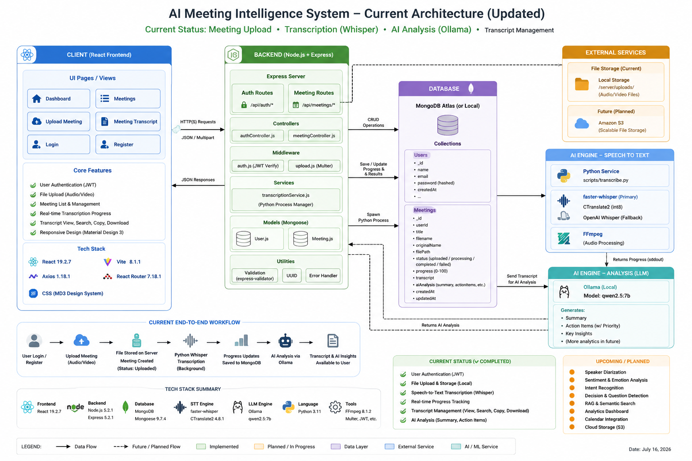

# 🧠 AI Meeting Intelligence System


A full-stack, AI-powered web application designed to transform audio and video meeting recordings into actionable insights. The system currently features highly accurate, locally hosted speech-to-text transcription utilizing `faster-whisper`, alongside a polished user interface for uploading, tracking, and interacting with meeting transcripts.

Built as a robust foundation for a comprehensive meeting intelligence platform, it currently features LLM-based summarization, structured insight generation, and a fully functional stateful Retrieval-Augmented Generation (RAG) chat engine using local Ollama models and Qdrant.

---

## ✨ Key Features

### 🟢 Currently Implemented
* **Secure Authentication:** JWT-based user registration and login with bcrypt password hashing, HTTP-only cookies, and rate limiting.
* **Seamless Media Uploads:** Drag-and-drop interface supporting major audio/video formats (MP3, WAV, M4A, MP4, etc.) up to 100MB.
* **Privacy-First AI Transcription:** Utilizes `faster-whisper` (CTranslate2, int8 quantization) running entirely on local CPU, ensuring sensitive meeting data never leaves your server.
* **Speaker Diarization:** Identifies and separates multiple speakers dynamically using `pyannote.audio`.
* **Real-Time Progress Tracking:** Live transcription progress streamed from Python to the Node.js backend and displayed dynamically on the React frontend.
* **AI Summarization & Action Items:** Automatic generation of meeting minutes, key takeaways, and action items utilizing a local Ollama integration (e.g. `qwen2.5:7b`).
* **Interactive Transcript Viewer:** Full-text search with match highlighting, one-click clipboard copying, and `.txt` file downloading.
* **Enterprise RAG Chat Engine:** Chat with your meeting history using a locally hosted vector database (Qdrant) and hybrid retrieval (RRF). Features include dynamic prompt orchestration, response citations, and conversational memory across the session.
* **Sentiment & Emotion Analysis:** Understand the tone and emotional trajectory of discussions dynamically.
* **Analytics Dashboard:** Visualize meeting durations, speaker participation, and organizational trends.
* **Calendar & Notifications:** ICS calendar export and automated action-item reminders (Google & Outlook integrations).
* **Robust Error Handling:** Decoupled AI processing ensures transcripts are saved even if LLM analysis fails. Fallback from `faster-whisper` to `openai-whisper` ensures reliable transcription.

---

## 🏗️ System Architecture

The application utilizes a decoupled, modern three-tier architecture:

<p align="center">
  
</p>

### Technology Stack Detailed

**Frontend (Client)**
* **Core:** React 19, Vite, React Router DOM
* **State Management:** React Context API + `useReducer`
* **Styling:** Custom Vanilla CSS implementing Google Material Design 3 tokens
* **HTTP Client:** Axios (with interceptors for automated auth handling)

**Backend (Server)**
* **Core:** Node.js, Express.js 5
* **Database:** MongoDB, Mongoose ODM
* **Security:** JSON Web Tokens (jsonwebtoken), bcryptjs, express-validator
* **File Handling:** Multer (multipart/form-data parsing), uuid

**AI Pipeline (Node.js & Python)**
* **Transcription Engine:** `faster-whisper` (Primary), `openai-whisper` (Fallback)
* **Inference Backend (STT):** CTranslate2 (Optimized for CPU via int8 quantization)
* **Audio Processing:** FFmpeg (Resolved via WinGet/System PATH)
* **LLM Engine:** Local Ollama (`qwen2.5:7b` via Node.js API)
* **Vector Database:** Qdrant (for RAG embeddings and semantic search)
* **Embedding Model:** `nomic-embed-text` (via Ollama)

---

## 📂 Project Structure

```text
meeting-intelligence/
├── client/                 # React Frontend application
│   ├── public/             # Static assets
│   ├── src/
│   │   ├── components/     # Reusable UI elements (Navbar, Sidebar, Loaders)
│   │   ├── context/        # Global state (AuthContext)
│   │   ├── pages/          # Route components (Dashboard, Upload, Transcript)
│   │   ├── services/       # Axios API integration layer
│   │   └── styles/         # Global design system (index.css)
│   └── vite.config.js      # Vite build configuration
│
├── server/                 # Express Backend application
│   ├── config/             # Database connection setup
│   ├── controllers/        # Request handlers (Auth, Meetings)
│   ├── middleware/         # JWT verification, Multer upload config
│   ├── models/             # Mongoose schemas (User, Meeting)
│   ├── routes/             # API endpoint definitions
│   ├── scripts/            # Python AI integration (transcribe.py)
│   ├── services/           # Child process orchestration
│   └── uploads/            # Local storage for audio/video files
│
└── PROJECT_IMPLEMENTATION_STATUS.md  # Detailed technical documentation
```

---

## 🚀 Installation & Setup

### Prerequisites

Ensure you have the following installed on your host machine:
* **Node.js** (v18.x or higher)
* **Python** (v3.10 or higher, added to PATH)
* **MongoDB** (Running locally on port `27017` or a cloud MongoDB Atlas cluster)
* **FFmpeg** (Required for Whisper audio decoding. Must be added to PATH or specified in `.env`)

### 1. Repository Setup

```bash
git clone https://github.com/sanjaynesan-05/MEETINGBUDDY.git
cd meeting-intelligence
```

### 2. Backend Initialization

Navigate to the server directory, install Node dependencies, and prepare the Python environment:

```bash
cd server
npm install

# Install required Python ML packages
pip install faster-whisper openai-whisper torch av

# Ensure the uploads directory exists
mkdir uploads
```

**Environment Configuration:**
Create a `.env` file in the `server` directory (reference `.env.example`):

```env
PORT=5000
MONGO_URI=mongodb://localhost:27017/meeting_intelligence
JWT_SECRET=generate_a_secure_random_string_here
JWT_EXPIRE=7d

# File Upload Configuration
MAX_FILE_SIZE=104857600 # 100MB in bytes
UPLOAD_DIR=uploads

# AI Transcription Settings
WHISPER_MODEL=base      # Options: tiny, base, small, medium, large-v3
WHISPER_LANGUAGE=en     # Leave blank for auto-detect

# AI LLM Settings
OLLAMA_MODEL=qwen2.5:7b # Default local LLM for meeting analysis

# FFmpeg Configuration (Absolute path to executable)
# Note: On Windows, use double backslashes or raw string format if needed
FFMPEG_PATH=C:\path\to\your\ffmpeg.exe
```

Start the backend server in development mode:
```bash
npm run dev
# Server running on http://localhost:5000
```

### 3. Frontend Initialization

Open a new terminal window, navigate to the client directory, and start the Vite dev server:

```bash
cd client
npm install
npm run dev
# Application running on http://localhost:5173
```

---

## 📖 Usage Walkthrough

1. **Create an Account:** Navigate to `http://localhost:5173/register` and create a new user profile.
2. **Upload a Meeting:** Access the "Meetings" tab from the sidebar and click "Upload Meeting". Drag and drop your `.mp4`, `.mp3`, or `.m4a` file.
3. **Monitor Progress:** Once uploaded, you will be redirected to the transcript viewer. The system processes the audio asynchronously, providing a live progress bar as Whisper decodes the speech.
4. **Interact with Data:** Upon completion, the full transcript is rendered. Use the inline search to find specific topics, copy text to your clipboard, or export the raw `.txt` file for external use.

---

## 📡 Core API Reference

| Method | Endpoint | Description | Auth Required |
|--------|----------|-------------|---------------|
| `POST` | `/api/auth/register` | Register a new user | ❌ |
| `POST` | `/api/auth/login` | Authenticate and retrieve JWT | ❌ |
| `GET`  | `/api/auth/profile` | Retrieve current authenticated user | ✅ |
| `POST` | `/api/meetings/upload` | Upload media & trigger transcription | ✅ |
| `GET`  | `/api/meetings` | Retrieve user's meeting history | ✅ |
| `GET`  | `/api/meetings/:id` | Fetch specific meeting & transcript | ✅ |
| `DELETE`| `/api/meetings/:id` | Permanently delete meeting & media | ✅ |
| `POST` | `/api/chat/message` | Ask RAG chatbot a question | ✅ |
| `GET`  | `/api/calendar/ics` | Export action items as ICS | ✅ |

---

## 🛠️ Troubleshooting

**"Missing ffmpeg" Error during transcription:**
Whisper requires FFmpeg to extract audio from video containers. Ensure FFmpeg is installed on your OS. If it is not in your system PATH, you must explicitly set the absolute path to `ffmpeg.exe` in the `server/.env` file under the `FFMPEG_PATH` variable.

**Transcription is very slow:**
The system defaults to the `base` model running on `cpu` with `int8` compute type. If it is still too slow, you can lower the model size by changing `WHISPER_MODEL=tiny` in your `.env` file. (Note: This trades accuracy for speed).

---

## 📜 License

Developed as an academic Final Year Project. All rights reserved.
